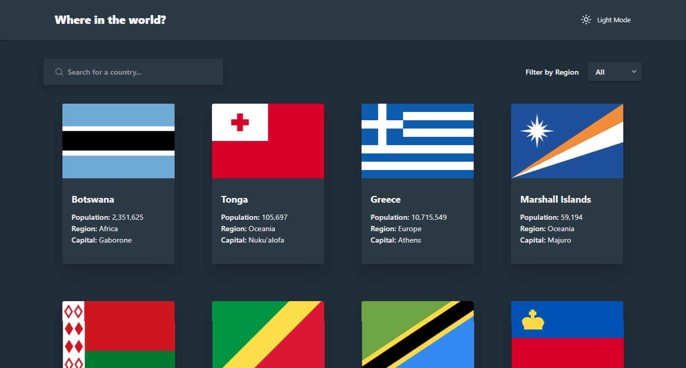

<div align="center">
  
  <h2>Where In the World?</h2>

</div>

A responsive Single Page Application (SPA) and Progressive Web App (PWA) that lets users explore and search for information about countries worldwide.

This project was originally developed as a solution to the [REST Countries API with color theme switcher challenge on Frontend Mentor](https://www.frontendmentor.io/challenges/rest-countries-api-with-color-theme-switcher-5cacc469fec04111f7b848ca).



## Features

* Browse a list of countries and search by name or capital city.
* Filter countries by region.
* View detailed information about each country, including:

  * Flag
  * Name
  * Population
  * Region
  * Capital
  * Top-Level Domain
  * Currency
  * Language
  * Border Countries
* Toggle between Dark and Light modes.

View performance analysis [here](https://pagespeed.web.dev/analysis/https-where-in-the-world-abdalrhman-me/rlzhkz8ler?form_factor=mobile).

## Built With

* [React](https://reactjs.org/)
* [Vite](https://vitejs.dev/)
* [React Router](https://reactrouter.com/)
* [Tailwind CSS](https://tailwindcss.com/)
* [TanStack Query](https://tanstack.com/query/latest)
* [Biome](https://biomejs.dev/)

## API

This project uses the [REST Countries API](https://restcountries.com/) to fetch country data. The API is free to use and requires no authentication.

Endpoints used:

* All countries: `https://restcountries.com/v3.1/all`
* Country by CCCA3 code: `https://restcountries.com/v3.1/alpha/{code}`

## Country Flags

The [REST Countries API](https://restcountries.com/) provides country flags in PNG and SVG format from the [flagpedia.net API](https://flagpedia.net/download/api), but I did not use it because the flags have different aspect ratios, which caused inconsistent card sizes and large Cumulative Layout Shift (CLS) on the home page.

So I used [country-flag-icons](https://www.npmjs.com/package/country-flag-icons), a package that provides country flags in a 3:2 aspect ratio.

View performance analysis [here](https://pagespeed.web.dev/analysis/https-where-in-the-world-abdalrhman-me/rlzhkz8ler?form_factor=mobile).

## Live Demo

Check out the live demo here:

https://where-in-the-world.abdalrhman.me

## Installing as a PWA

This app is a Progressive Web App (PWA), allowing installation on your device:

1. Visit the app at https://where-in-the-world.abdalrhman.me
2. Open the browser menu and select "Install Where In the World".
3. Follow the prompts to add it to your home screen.

## Running Locally

1. Clone the repository:

```
git clone https://github.com/abdalrhman-almarakeby/where-in-the-world.git
```

2. Navigate to the project directory:

```
cd where-in-the-world
```

3. Install dependencies:

```
pnpm install
```

4. Start the development server:

```
pnpm run dev
```

5. Open [http://localhost:3000](http://localhost:3000/) in your browser.

## Contact

* **GitHub:** [Abdalrhman Almarakeby](https://github.com/Abdalrhman-Almarakeby)
* **LinkedIn:** [Abdalrhman Almarakeby](https://www.linkedin.com/in/abdalrhman-almarakeby/)
* **Email:** [contact@abdalrhman.me](mailto:contact@abdalrhman.me)
