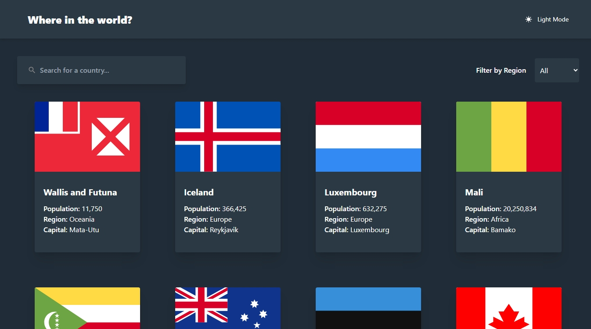

<div align="center">
  
  <p>Where In the World?</p>
</div>

# Where In the World?

A responsive Progressive Web App (PWA) that allows users to view and search for information about countries around the world.

This project was created as a solution to the [REST Countries API with color theme switcher challenge on Frontend Mentor](https://www.frontendmentor.io/challenges/rest-countries-api-with-color-theme-switcher-5cacc469fec04111f7b848ca).



## Overview

- Browse a list of countries and search for a specific country by name or capital city.
- Filter countries by region.
- Click on a country to view detailed information, including:
  - Flag
  - Name
  - Population
  - Region
  - Capital
  - Top-Level Domain
  - Currency
  - Language
  - Border Countries
- Dark/Light mode toggle.

View performance analysis overview [here](https://pagespeed.web.dev/analysis/https-where-in-the-world--app-vercel-app/r7d9x7qvny?form_factor=mobile).

## Built With

- [React](https://reactjs.org/)
- [Vite](https://vitejs.dev/)
- [React Router](https://reactrouter.com/)
- [Tailwind CSS](https://tailwindcss.com/)

## API

This project uses the [REST Countries API](https://restcountries.com/) to fetch country data.

The API is free to use and does not require authentication.

The following endpoints were used:

- All - `https://restcountries.com/v2/all`
- CCCA3 Code - `https://restcountries.com/v3.1/alpha/{code}`

## Country Flags

The [REST Countries API](https://restcountries.com/) provides country flags in PNG and SVG format from the [flagpedia.net API](https://flagpedia.net/download/api), but I did not use it because the flags have different aspect ratios, which caused inconsistent card sizes and large content shifts on the home page.

So I used [country-flag-icons](https://www.npmjs.com/package/country-flag-icons), a package that provides country flags in a 3:2 aspect ratio.

View performance analysis [here](https://pagespeed.web.dev/analysis/https-where-in-the-world--app-vercel-app/r7d9x7qvny?form_factor=mobile).

## Live Demo

You can view a live demo hosted on Vercel:

https://where-in-the-world--app.vercel.app/

## installing as a Progressive Web App (PWA)

This app is a Progressive Web App (PWA), which means you can install it on your device. Here’s how to install it:

- Visit the app URL https://where-in-the-world-ecru.vercel.app/ in your browser.

- Click on the browser's menu and select "Install Where In the World".

- Follow the prompts to install the app on your device's home screen.

## Running Locally

1.  Clone the repository:

```
git clone https://github.com/abdalrhman-almarakeby/where-in-the-world.git
```

2.  Navigate to the project directory:

```
cd where-in-the-world
```

3.  Install dependencies:

```
npm install
```

4.  Start the local development server:

```
npm run dev
```

5.  Open [http://localhost:3000](http://localhost:3000/) in your browser.

## Contact

Github: [Abdalrhman Almarakeby](https://github.com/Abdalrhman-Almarakeby)

Linkedin :[Abdalrhman Almarakeby](https://www.linkedin.com/in/abdalrhman-almarakeby/)

Email: almarakeby.work@gmail.com
